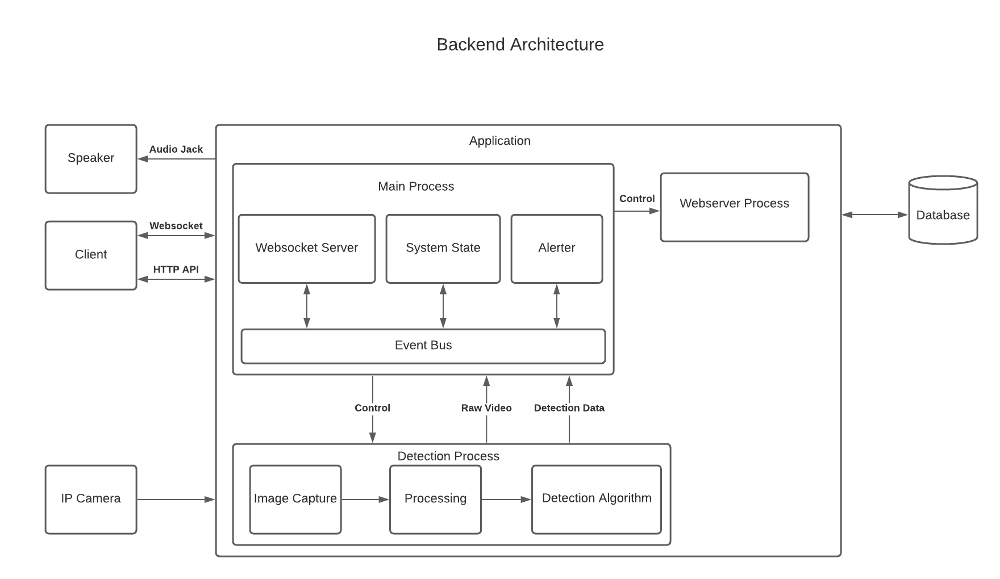
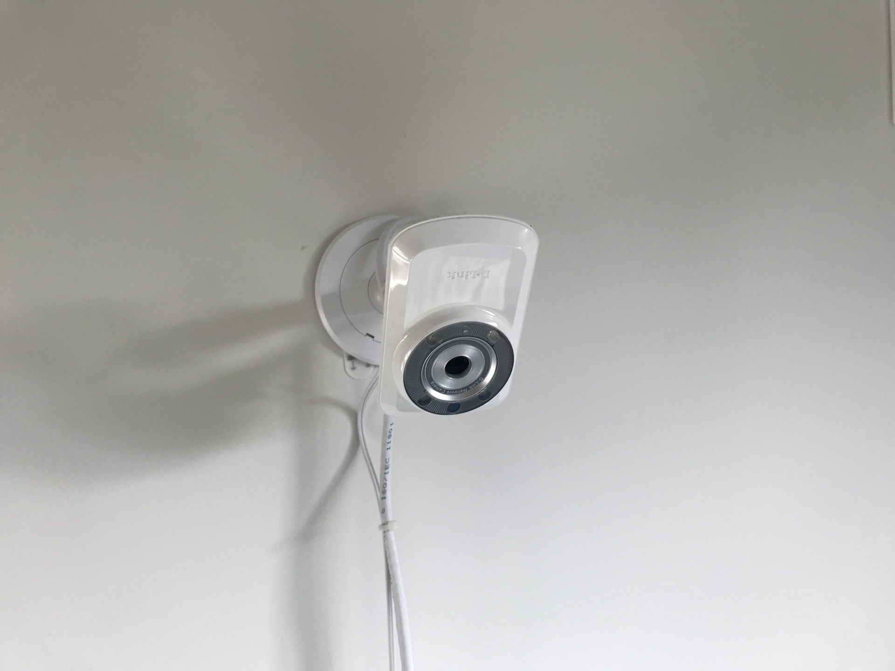
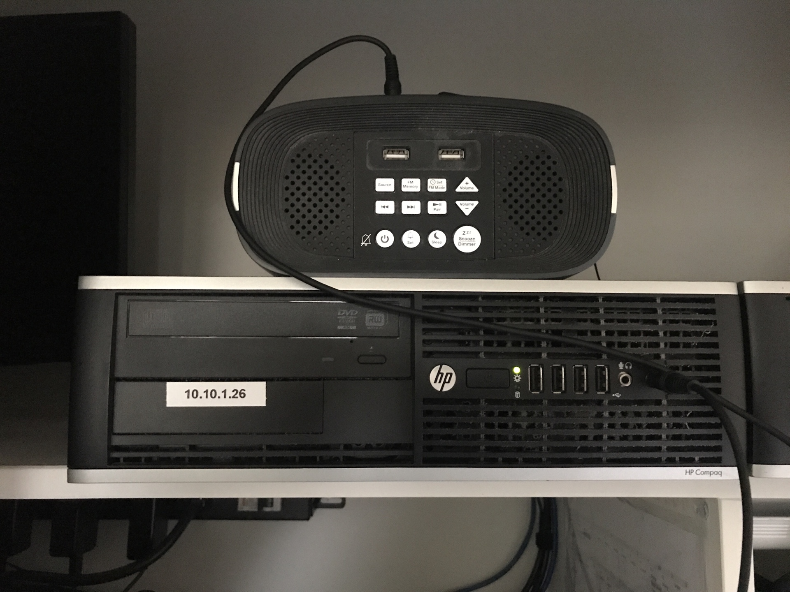
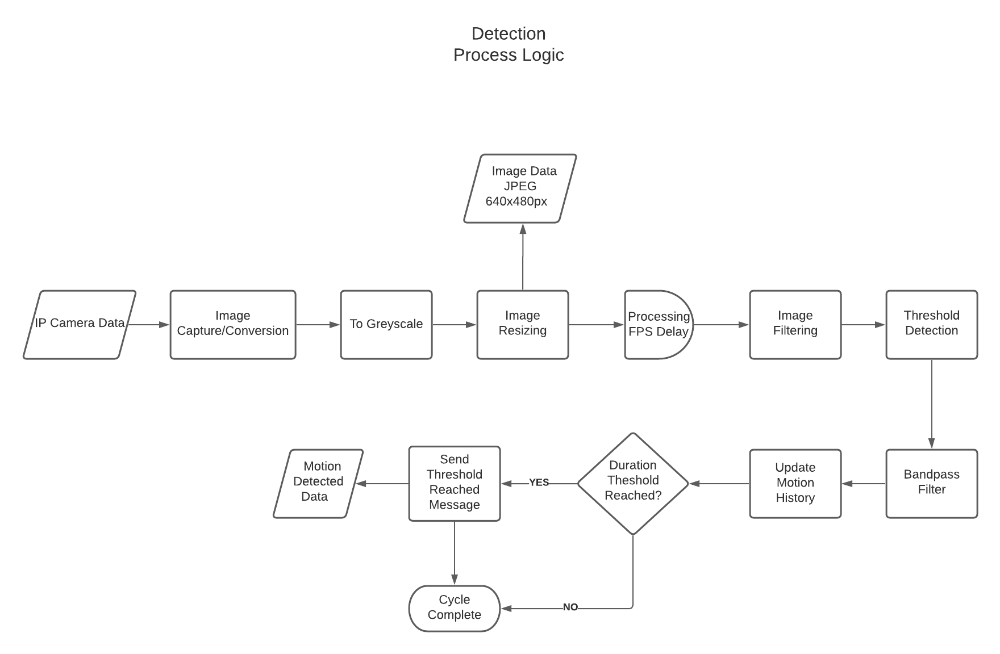

# Overview

The Overwatch application is designed to detect and alert users in real time to the potential of a epilectic seizure during sleep. This is achieved by utilising COTS components to identify movement through computer vision and raise an alert via a speaker and messaging service.
The system is designed to be run on a modest computer running Linux which interfaces with an IP camera and external speaker.
The application is extensible allowing alerting methods to be added easily through a plugin mechanism.

## Components

| Component         | Description                             | Technology/Library          |
| ----------------- | --------------------------------------- | ----------------------------|
| Main Process      | Main application                        | Python Asyncio              |
| Detection Process | Image capture/processing and detetction | Python OpenCV               |
| Webserver Process | Web server to serve application         | Python Starlette/Javascript |
| Database          | Storage of recorded seizure event       | SQLite                      |
| IP Camera         | Generic IP camera serving MJPEG video   |                             |

IP Camera installed above bed.

Desktop PC with external speaker running application.

## Main Process

The function of the main process is to:
1. Load the configuration from the configuration file and command line input.
2. Manage the detection and web server processes, restarting them if required (watchdog).
3. Allow real time video and data transfer to clients via a websocket connection.
4. Maintain the state of the appication and raise external alerts when required. 
5. Save a video of the last three minutes of capturing when an alert is raised (For future viewing/analysis).

## Detection Process

The purpose of the detection process is to process incoming video frames, detect motion and re-encode the video as MJPEG (640x480).

The logic of the detection algorithm is currently based on the change of pixels between captured video frames. The change in pixels between frames is stored and if the change exceeds a threshold for three minutes then an alert is triggered. Pre-processing is applied to each frame in the form of grey scaling and noise reduction (Guassian blurring) to reduce the rate of false alerts.

## Web Server Process

The purpose of the web server process is to serve web pages to the client to:
1. Allow control of the application.
2. View the captured video in real time.
3. View, add and edit records of seizure events.

## Database

The purpose of the database is to store the recorded seizure event information

## IP Camera

The purpose of the IP camera is capture video for analysis. The camera must be capable of capturing video in low light conditions.
