# User Guide

## Overview

This application is designed to detect small movements of a subject in bed during sleeping hours that could be an epilectic seizure. This is achieved by viewing the subject via a web camera and analysing the video for movement. If the detected movement exceeds five (5) minutes in length then an audible alarm is sounded from the computer running the application and a message is sent via the Telegram messaging service. The application is controlled via a tablet or phone running a modern web browser.
The application can also be used to keep track of seizure events by allowing them to be recorded and viewed later. This data is used to provide an overview of seizure activity such as frequency and average duration.

## Connecting and Navigation

Connecting to the application requires a modern browser such as Chrome, Firefox or Safari. The application can be run on a variety of screen size devices from mobile phones up to desktops. Ensure that you are connected to the same WiFi network as the computer running the application and enter http://*address*:9876 into the browser's address bar (where *address* is the IP adress of the computer running the application). Upon successfully connecting the following home screen will be presented.

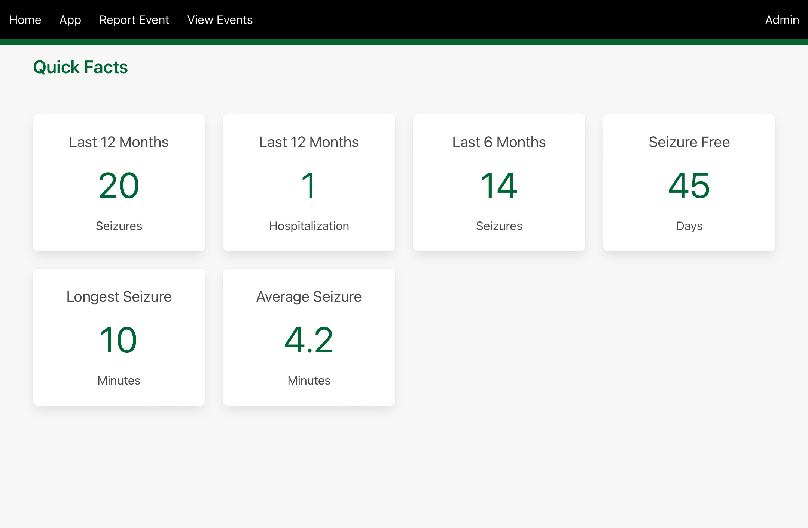

Navigation is achieved via the top navigation bar, from left to right:
- **Home** - Displays the home page with quick statistics on all recorded seizure events such as average length and frequency.
- **App** - Displays the controls and status of the detection system.
- **Report Event** - Allows the user to enter the details of a seizure event.
- **View Events** - Displays all reported seizure events in reverse chronological order and allows editing and deleting of individual reports.
- **Admin** - Allows access to the server configuration, metrics and recorded video (currently a work in progress).

## Application

The detection and alerting can be controlled from the *App* page as displayed below.

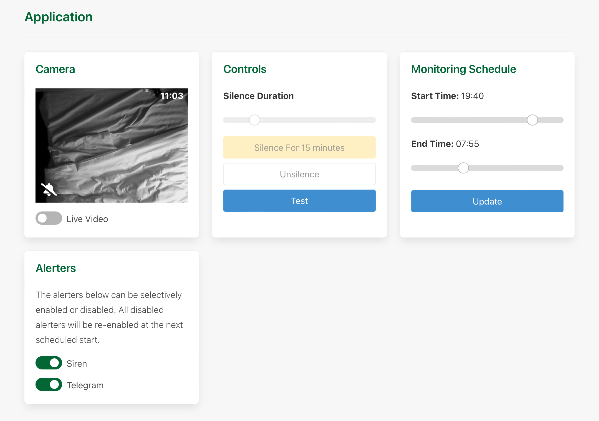

The application page is divided into four panels:
### Camera
This panel primarily displays a camera view and an overlay indicating the real time status of the system. If the *Live video* switch is off the camera view will refresh every second with a snapshot view, else the view will display real time video. Below is an composite image of all the status symbols that can be displayed by the application.

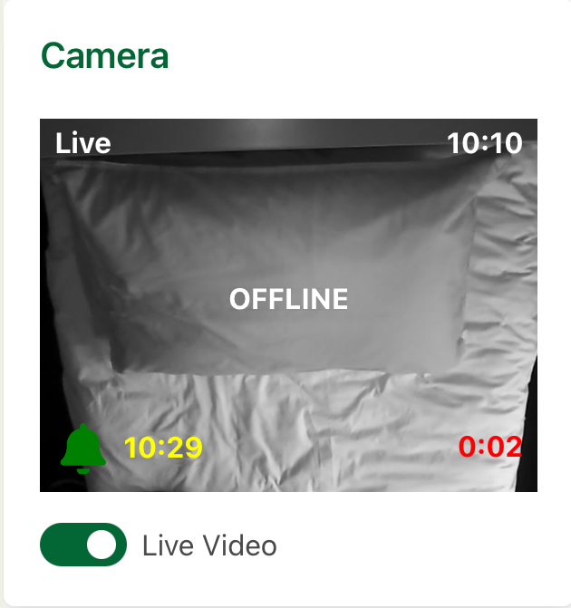

- The top left corner displays *Live* if live video is currently selected, otherwise nothing.
- The top right corner displays the current time in 24 hour format.
- The center of the camera displays *OFFLINE* if an error has occurred connecting to the camera, otherwise nothing.
- The bottom left corner displays an icon representing the current state of the application.
- To the right corner of the current system state icon is the time the system is silenced till in 24 hour format. This will only display if the application is actively silenced.
- The bottom right corner displays the time in minutes and seconds since the current alert was raised, this resets after 30 minutes. This is useful in determining the first alert time in a cluster of alerts.

The application can be in a number of states as displayed by the status icon.

OFF - No monitoring is currently active.

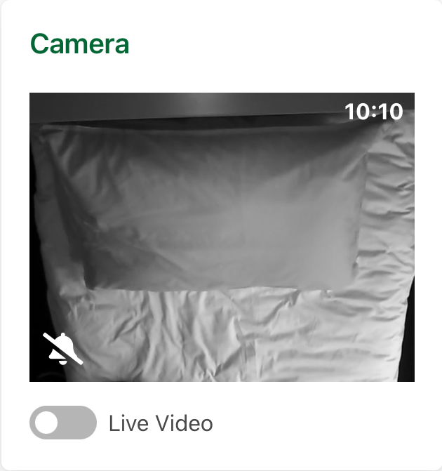

ON - The system is actively analysing for movement and a alert will be raised if necessary.

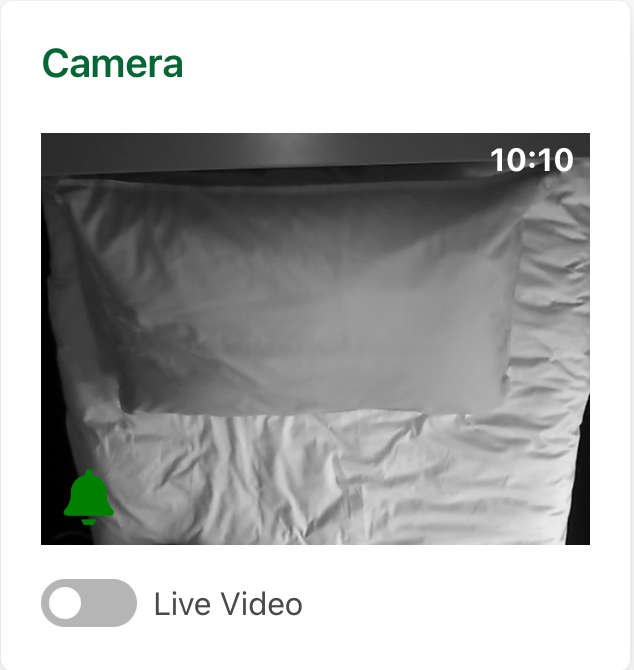

SILENCED - The system is active but no alerts will be raised, the application will revert to *ON* once the silence period has ended (displayed by the yellow time).

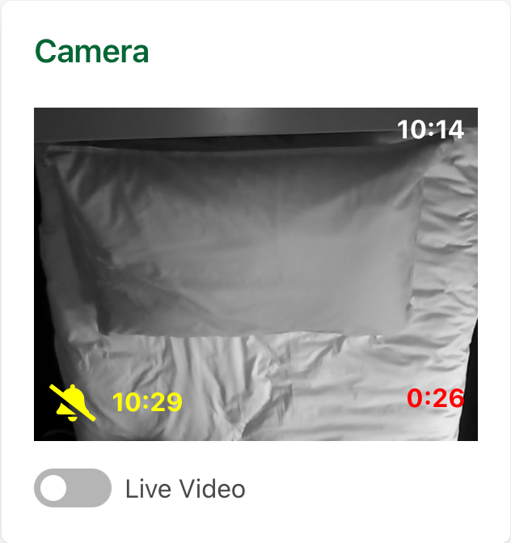

ALARM - The system has determined a seizure may be occuring and has raised an alert.

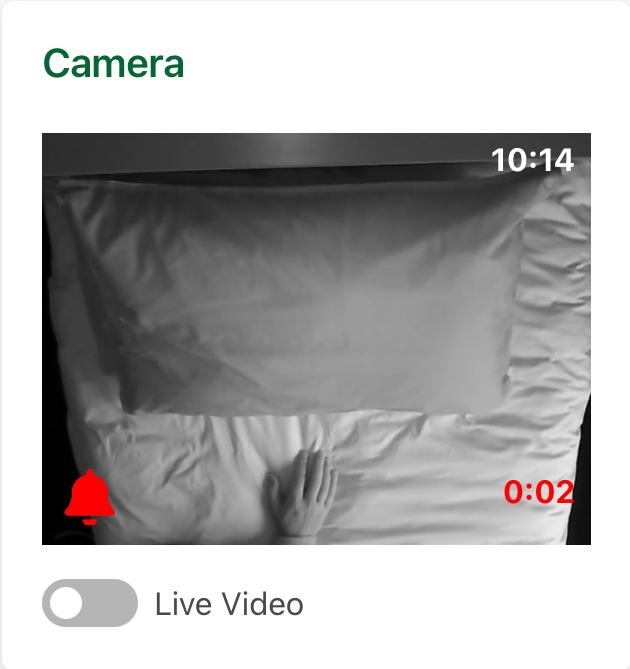

### Controls
This panel allows silencing, unsilencing and testing of the system. The length of the silence duration can adjusted by the slider with the range being between 5 and 60 minutes. If the application has been silenced the *Unsilence* button will become selectable allowing the current silence to be cancelled. Once silenced the application wiil not raise alerts until the silence period has ended (This can be useful to temporarily stop alerts if required due to excessive movement before sleep etc).

The system alerters may be tested at any point without affecting the system, once the *Test* button is clicked the following screen will display, informing the user that the application will test all the alerters. If an alerter has been disabled in the alerter panel then that alerter will not be activated during the test.

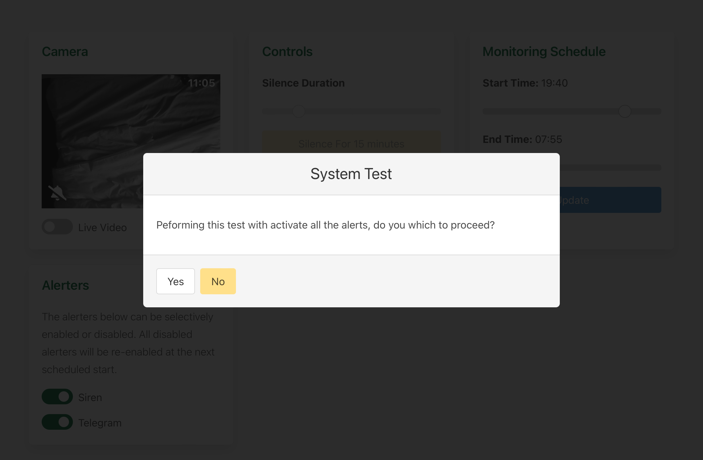

### Monitoring Schedule
This panel allows the start and stop times (in 24 hour format) of monitoring to be viewed and changed if required. Once adjusted the *update* button must be clicked to update the application settings.

### Alerters
This panel allows individual alerters to be selected/de-selected. A deselected alerter will not function either when an alert is raised or when a test is initiated. All deselected alerters will revert to selected upon the next scheduled start time (this prevents an alerter from being inadvertently permanently disabled).

## Seizure Events

### Reporting an Event
Seizure events can be reported via the *Report Event* link in the main menu bar as displayed below. Once submitted the report will be saved and the data used to update the statistics displayed on the home page.

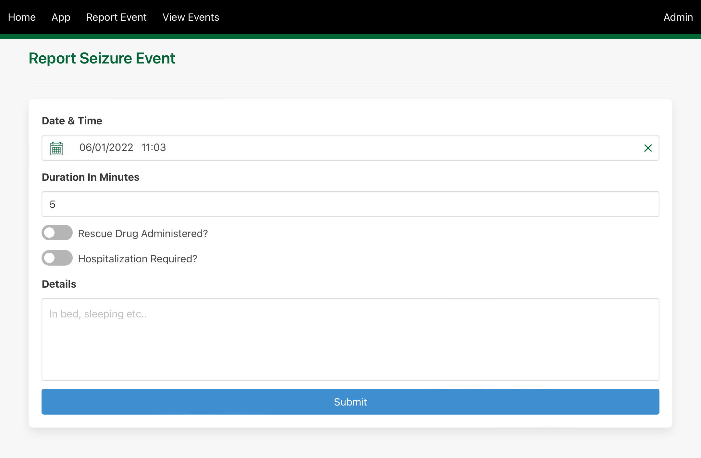

### Viewing and Editing Events

Reports can be viewed fron the *View Events* link in the main menu bar as displayed below. Reported events are displayed in reverse chronological order and can be edited or deleted using the appropriate button at the bottom of each card.

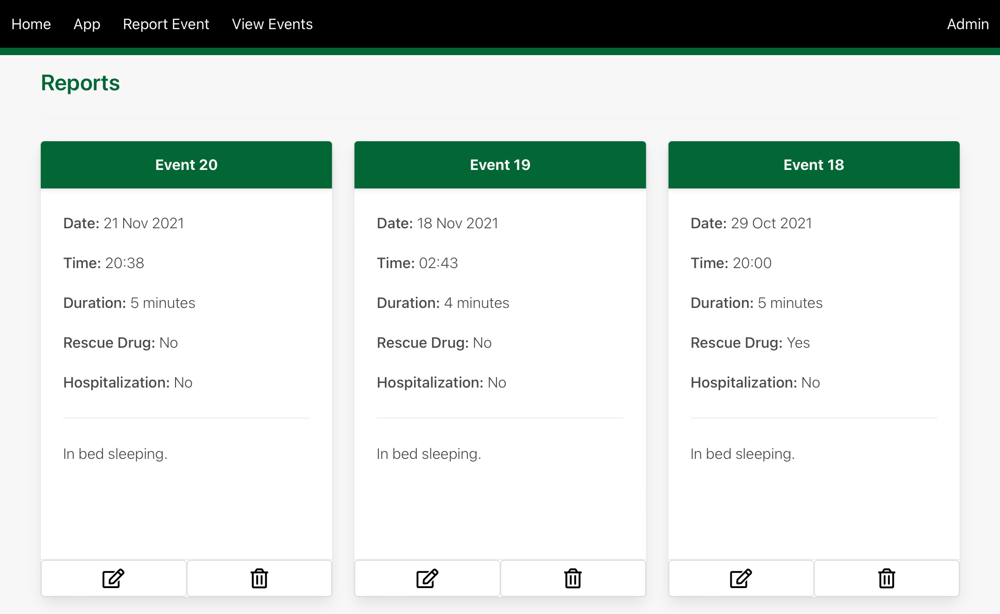

Editing an event displays a form as below where all the previously entered data can be edited as required.

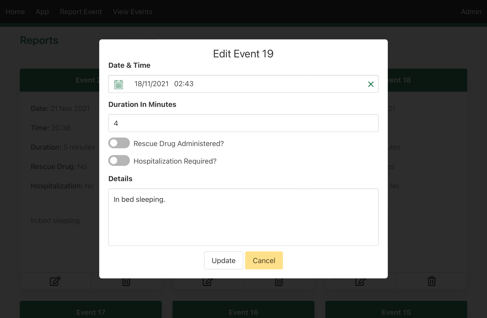

Deleting an Event.

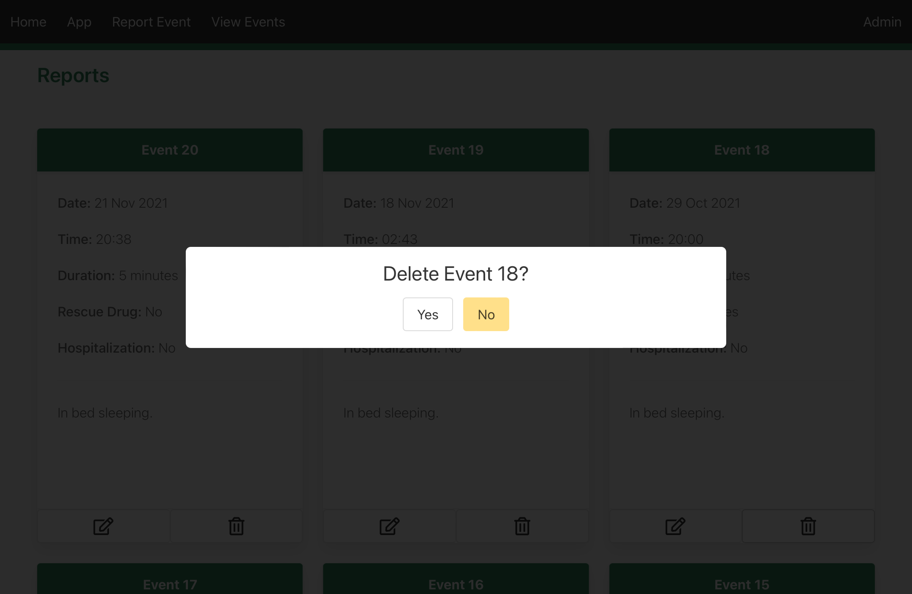

## FAQ

Will the application detect all types of seizures?

*No, the application is currently tuned to only detect small movements associated with a tonic clonic seizure.*

Why is the application continuously sounding alerts but there has been no movement or seizures?

*The application can be affected by shiny objects and clothing that is striped or has patterning, try to eliminate these if possible.*

The camera view is displaying "OFFLINE", why is this?

*First try refreshing the web page, else check the web camera is on and connected to the local network.*

